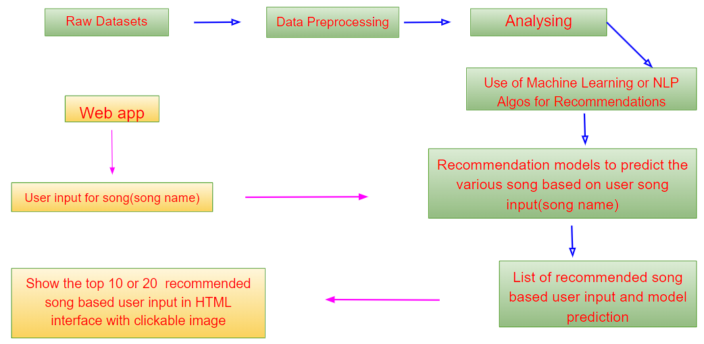
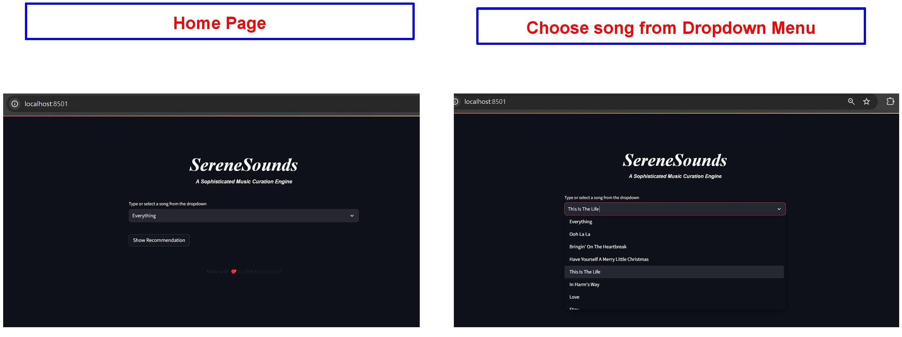
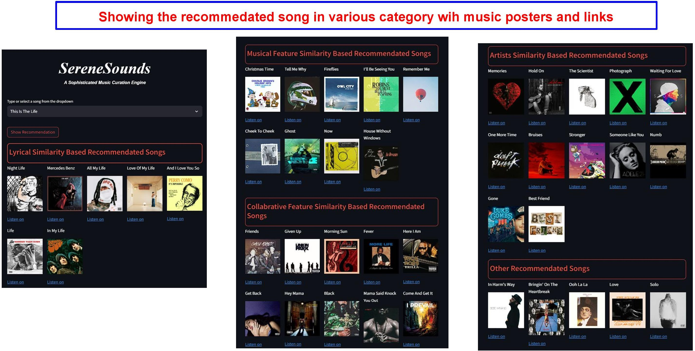

# SereneSounds

SereneSounds is a sophisticated music curation web app that leverages various recommendation techniques to provide users with diverse and personalized music suggestions. The project is built using Python and Streamlit, with backend recommendation models implemented through collaborative filtering, Alternating Least Squares (ALS) algorithm, lyric and musical feature similarity, and artist similarity using graph models.
## Table of Contents
1. [Objectives](#Objectives)
2. [Features](#Features)
3. [Technology Stack](#technology_stack)
4. [Project Architectur](#project_architectur)
5. [Dataflow Diagram](#dataflow-diagram)
6. [Project Structure](#project-structure)
7. [Recommendation Systems](#recommendation-systems)
   - [Collaborative Filtering](#collaborative-filtering)
   - [Artist Similarity (Graph Model)](#artist-similarity-graph-model)
   - [Collaborative Filtering based on Musical Features](#collaborative-filtering-musical-features)
   - [Lyrics Similarity](#lyrics-similarity)
   - [ALS Algorithm for General Recommendations](#als-algorithm-general-recommendations)
8. [Web App Screenshots](#web-app-screenshots)
9. [Getting Started](#getting-started)
   - [Prerequisites](#prerequisites)
   - [Installation](#installation)
10. [Usage](#usage)
11. [Contributing](#contributing)
12. [License](#license)

## Objectives<a name="Objectives"></a>

- **Personalized Music Recommendations:** SereneSounds aims to offer users a personalized music listening experience by recommending songs based on their preferences, exploring both content-based and collaborative filtering approaches.

- **Diverse Recommendation Techniques:** The project employs a combination of recommendation techniques, including collaborative filtering, ALS algorithm, lyric similarity, musical feature similarity, and artist similarity, ensuring a diverse set of music recommendations.

- **User Interaction:** The web app provides a user-friendly interface where users can select a song and receive recommendations based on different algorithms and similarity metrics.


## Features<a name="Features"></a>


1. **Lyric Similarity Recommendations:** Discover songs with similar lyrics to your favorite tracks.
2. **Musical Feature Similarity Recommendations:** Explore songs with similar musical features such as danceability and energy.
3. **Collaborative Filtering:** Get recommendations based on collaborative filtering techniques.
4. **ALS Algorithm Recommendations:** Recommendations using Alternating Least Squares (ALS) algorithm.
5. **Artist Similarity Recommendations:** Discover songs based on artist collaborations using graph models.

## Technology Stack<a name="technology_stack"></a>


- **Streamlit:** A Python library for creating interactive web applications. Streamlit simplifies the process of turning data scripts into shareable web apps.

- **Python:** The core programming language used for implementing recommendation algorithms, data processing, and web app functionality.

- **Pandas:** A powerful data manipulation and analysis library in Python, used for handling and processing the music dataset.

- **NetworkX:** A Python package for the creation, manipulation, and study of complex networks. Used for constructing and analyzing the artist collaboration graph.

- **Spotipy:** A Python library for interacting with the Spotify Web API, used for obtaining album cover URLs for songs.

- **ALS Algorithm:** Alternating Least Squares is a matrix factorization technique used for collaborative filtering recommendations. The ALS model is trained on a user-item matrix to capture latent factors.

- **TF-IDF Vectorization:** Used for lyric-based and musical feature-based recommendations. It converts text data into numerical vectors to measure the importance of words in a song.

## Project Architecture<a name="project_architecture"></a>

The SereneSounds project follows a modular architecture with distinct components:
- **Data Handling:** The `music.py` module loads the music dataset, while the `poster_maker.py` module uses the Spotify API to fetch album cover URLs.

- **Recommendation Models:** Modules in the `recommenders` package implement different recommendation techniques, including ALS-based collaborative filtering, artist similarity using graph models, and lyric and musical feature similarity.

- **Web App:** The `app.py` file uses Streamlit to create a user interface for song selection and displays recommendations based on the chosen algorithms.

- **User Signature:** The `signature.py` module adds a signature section to the web app to acknowledge the developer.

## Dataflow Diagram<a name="dataflow-diagram"></a>
<table align="center">
  <tr>
    <td></td>
  </tr>
</table>

## Project Structure<a name="project-structure"></a>
```
SereneSounds
├── app.py
├── content_renderer.py
├── data
│   ├── als_model.pkl
│   ├── graph_data.pkl
│   ├── lyrics_similarity.pkl
│   ├── musical_feature_similarity.pkl
│   ├── songs.csv
│   └── song_data.pkl
├── music.py
├── path.py
├── poster_maker.py
├── Recommendation_System.ipynb
├── recommenders
│   ├── als_recommenders.py
│   ├── artists_similarity_recommenders.py
│   ├── collaborative_recommenders.py
│   ├── lyrics_similarity_recommenders.py
│   └── musical_similarity_recommenders.py
└── signature.py

```


## Recommendation Systems<a name="recommendation-systems"></a>

### Collaborative Filtering<a name="collaborative-filtering"></a>
- User-item matrix created using CSR matrix representation.
- ALS model trained and serialized for efficient recommendation generation.
- Factor matrices extracted, and recommendations provided based on the dot product.

### Artist Similarity (Graph Model)<a name="artist-similarity-graph-model"></a>
- NetworkX graph represents artist collaborations.
- Serialized graph used for efficient loading and recommendation computation.
- Recommends songs by similar artists based on graph exploration.

### Collaborative Filtering based on Musical Features<a name="collaborative-filtering-musical-features"></a>
- Musical features concatenated and TF-IDF vectorization computes similarity.
- Recommendations based on the high-dimensional feature space of musical attributes.

### Lyrics Similarity<a name="lyrics-similarity"></a>
- Text data preprocessed for better understanding of song lyrics.
- TF-IDF vectorization calculates cosine similarity among songs.
- Songs with similar lyrics recommended to users.

### ALS Algorithm for General Recommendations<a name="als-algorithm-general-recommendations"></a>
- ALS model trained on a user-item matrix.
- Serialized model loaded to provide general music recommendations based on user preferences.

## Web App Screenshots<a name="web-app-screenshots"></a>
<table align="center">
  <tr>
    <td></td>
  </tr>
    <tr>
    <td></td>
  </tr>
</table>


## Getting Started<a name="getting-started"></a>

Before you can run the SereneSounds app, ensure that you have the necessary prerequisites installed on your machine.

### Prerequisites<a name="prerequisites"></a>

Make sure you have the following installed:

- [Python 3.x](https://www.python.org/downloads/): The programming language used to run the app.


### Installation<a name="installation"></a>

Follow these steps to set up the SereneSounds app on your local machine: 

1. **Clone the Repository:**

   Open your terminal and run the following commands:

   ```bash
   git clone https://github.com/shib1111111/SereneSounds.git
   cd SereneSounds

   ```

2. **Install Dependencies:**

Run the following command to install the required dependencies:

```bash
pip install -r requirements.txt
  ```

## Usage<a name="usage"></a>
To run the SereneSounds app, execute the following command in your terminal:
```bash
streamlit run app.py  
```
Visit the provided local URL (usually http://localhost:8501) in your web browser to access the app. <br>


## Contributing<a name="contributing"></a>

We welcome contributions to enhance SereneSounds. Feel free to open issues or submit pull requests.

## License<a name="license"></a>

This project is licensed under the [MIT License](LICENSE).

Thank you for using SereneSounds! Feel free to reach out with any questions or feedback.

<em style="color: #ff66b2; font-weight: bold;">✨ --- Designed & made with Love by Shib Kumar Saraf ✨</em>
